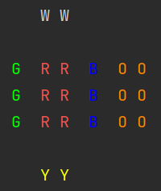
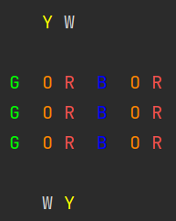
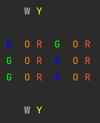

# Rubiks-Cube

Library that implements a representation of a
Rubik's Cube. The purpose of this implementation is
to use it for research purposes.

## How to use it?

The easiest way to create a Rubik's Cube is with
the `RubikCube` class. Here is an example:

```python
from rubiks_cube.cube import RubikCube
rc = RubikCube.from_dims((3, 2, 1))
print(rc)
```



If you want to make a move on the Rubik's Cube,
you can do it like the example:

```python
from rubiks_cube.cube import RubikCube
from rubiks_cube.movements import CubeMove
rc = RubikCube.from_dims((3, 2, 1))
rc.make_a_move(CubeMove.L2)
print(rc)
```



And you can make a series of movements in the following way:

```python
from rubiks_cube.cube import RubikCube
from rubiks_cube.movements import CubeMove
rc = RubikCube.from_dims((3, 2, 1))
rc.make_movements_from_list([CubeMove.L2, CubeMove.U2])
print(rc)
```



Another (equivalent) way to do this:

```python
from rubiks_cube.cube import RubikCube
rc = RubikCube.from_dims((3, 2, 1))
rc.make_movements_from_str("L2 U2")
print(rc)
```

