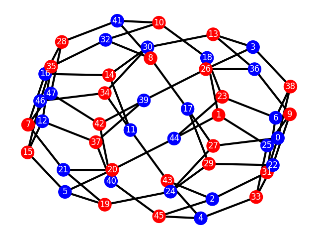

# Rubiks-Cube

Library that implements a representation of a
Rubik's Cube. The purpose of this implementation is
to use it for research purposes.

## How to use it?

The easiest way to create a Rubik's Cube is with
the `RubikCube` class. Here is an example:

```python
from rubiks_cube.cube import RubikCube
rc = RubikCube.from_dims((3, 2, 1))
print(rc)
```

Noting that a `RubikCube` instance is a hashable and immutable object (with the current methods).


### Making move on the Rubik's Cube

If you want to make a move on the Rubik's Cube,
you can do it like the example:

```python
from rubiks_cube.cube import RubikCube
from rubiks_cube.movements import CubeMove

rc = RubikCube.from_dims((3, 2, 1))
rc = rc.make_movements(CubeMove.L2)
print(rc)
```


You can make a series of movements with a list of `CubeMove`:

```python
from rubiks_cube.cube import RubikCube
from rubiks_cube.movements import CubeMove

rc = RubikCube.from_dims((3, 2, 1))
rc = rc.make_movements([CubeMove.L2, CubeMove.U2])
print(rc)
```


Or with a string with the representation of `CubeMove`:

```python
from rubiks_cube.cube import RubikCube

rc = RubikCube.from_dims((3, 2, 1))
rc = rc.make_movements("L2 U2")
print(rc)
```


### Making the Graph

Given a set of permitted movements

(where the permitted movements are operations over the group of Rubik's Cube), for example,
.
We expect to create a graph

where

and
.
The described graph can be computed with the following instructions:

```python
import networkx as nx
from matplotlib import pyplot as plt

from rubiks_cube.graph import make_graph
from rubiks_cube.movements import CubeMove as CM

g: nx.Graph = make_graph(
    dims=(3, 2, 1),
    permitted_movements={CM.R2, CM.D2, CM.U2}
)
nx.draw_kamada_kawai(
    g,
    node_color="red", node_size=50,
    edge_color="blue", width=3
)
plt.show()
```

And it plots the following graph:

